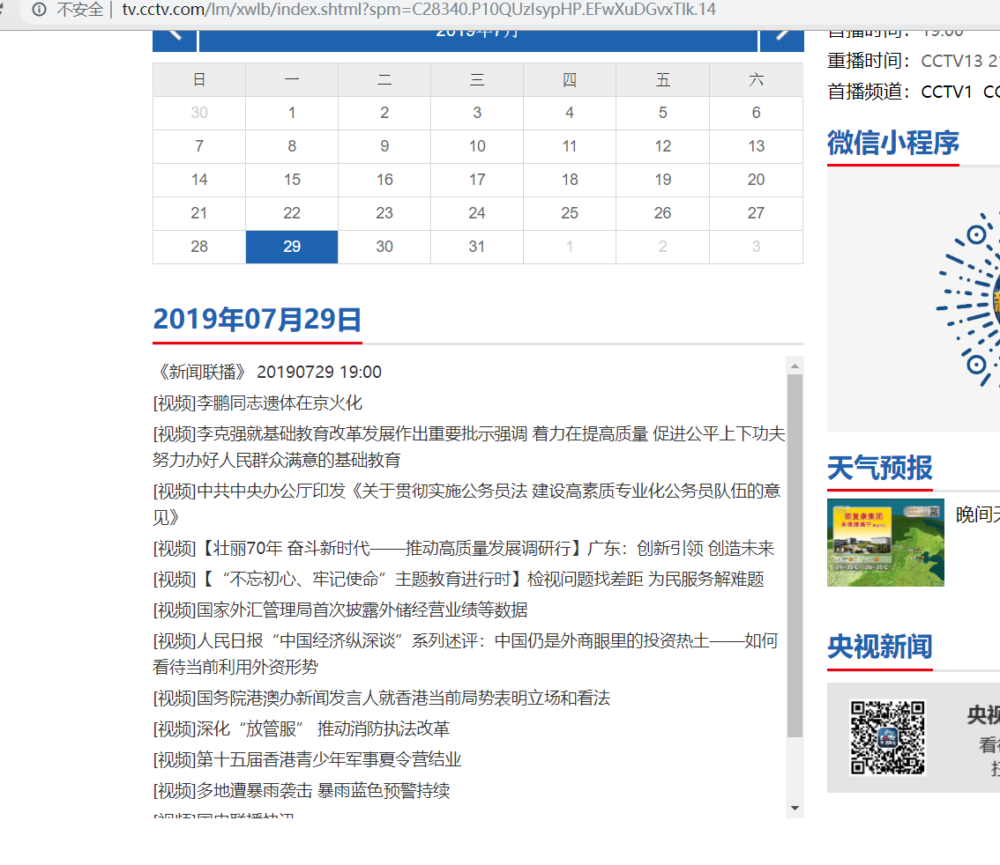
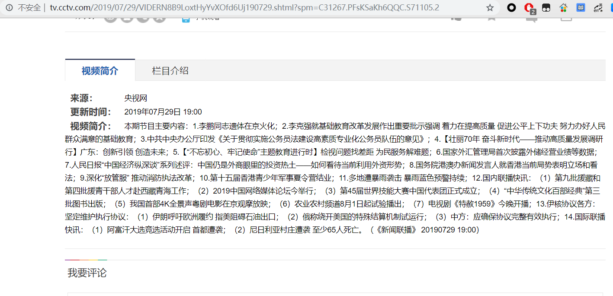
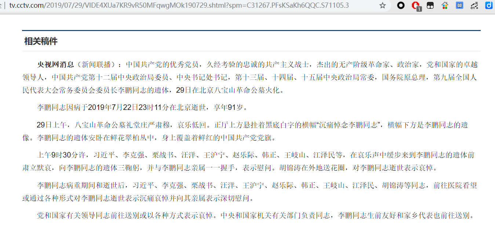

## 说明
本项目的是将CCTV.com上的新闻联播历年的节目内容爬取到本地并解析。本项目微博：[今天追新闻联播了吗](https://weibo.com/6390144374/profile)
抓取的思路为：
- 首先找到当日新闻的入口(图1)；
- 其次在当日新闻的主页找到节目简介和节目详细内容的链接；
- 最后解析节目简介和详细内容（图2和图3）。

图1：



图2：



图3：



网页保存路径：
- xwlb/是本次节目的主页保存路径
- xwlb/summarys/是本次节目的内容简介保存路径
- xwlb/details/是节目中的详细内容保存路径


## 配置

### 1.安装mongodb

参考链接[Ubuntu中安装mongodb](https://docs.mongodb.com/manual/tutorial/install-mongodb-on-ubuntu/)

### 2.安装运行scrapy_splash

```
pip install scrapy_splash
docker run -p 8050:8050 scrapinghub/splash
```

## 运行

项目根目录执行:
```
cd xwlb/xwlb
scrapy crawl spider
```

## 注意
本项目的spalsh和mongodb使用的都是本机地址。如果是其他机器需要进行配置。
splash:修改setting.py文件中的```SPLASH_URL=your ip```
mongodb：修改```/etc/mongod.conf中的：
```
# network interfaces
net:
  port: 27017
  bindIp: 0.0.0.0

```


